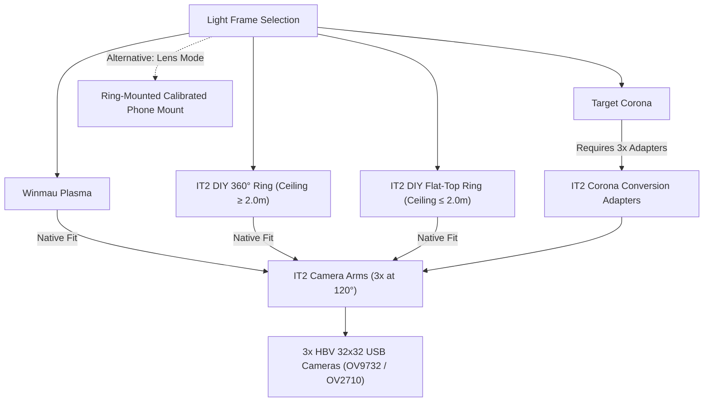
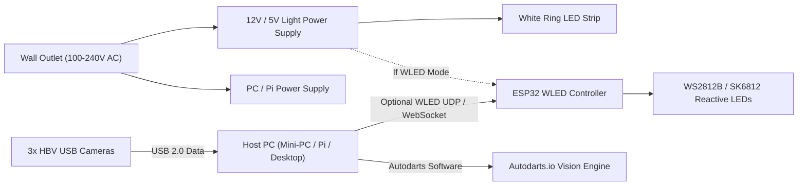

# IT2 System Architecture & Relationship Map

This document defines how all physical, electronic, and software components connect in the IT2 Autodarts system.

---

## 1. Physical Mounting Hierarchy

```mermaid
graph TD
    Environment["Mounting Anchor"] -->|Option A| Wall["Wall (Drywall / Brick)"]
    Environment -->|Option B| Stand["Mobile Dart Stand (Winmau Xtreme 2)"]

    Stand -->|MANDATORY| Baseplate["IT2 4-Part Baseplate"]
    Wall -->|Option 1: Recommended| Baseplate
    Wall -->|Option 2: Minimalist| DirectWall["Direct Wall Mount (8 holes)"]

    Baseplate -->|Anchors (3 holes)| Board["Dartboard (Rota Locks)"]
    Baseplate -->|Unlocks| TPU["TPU 95A Sound Dampeners"]
    Baseplate -->|Unlocks| RearBay["Hidden Rear Hardware Bay"]
    Baseplate -->|Unlocks| AmbientGlow["Perimeter Ambient WLED Halo"]
    Baseplate -->|Integrated| HiddenCables["Internal Rear Cable Raceways"]

    DirectWall -->|Anchors (2 holes)| Board
    DirectWall -->|Cabling Choice| SurroundTuck["Cables behind Surround"]
    DirectWall -->|Cabling Choice| RingClips["Ring Cable Clips with Y-Exit"]

    Baseplate -->|Plasma Hole Pattern| LightFrame["Light Ring / Frame"]
    DirectWall -->|Plasma Hole Pattern| LightFrame
```

---

## 2. Light Ring & Camera Arm Relationship

The IT2 mechanical standard is anchored 1:1 to the **Winmau Plasma hole pattern**.



---

## 3. Vision Mode Branches

| Feature / Requirement | Mode A: 3-Camera Rig (Classic IT2) | Mode B: Autodarts Lens (Smartphone) |
| :--- | :--- | :--- |
| **Cameras** | 3x HBV OV9732 (Budget) or OV2710 (Premium) | 0 PCB cameras (uses phone camera) |
| **Camera Arms** | 3x 3D-printed arms | None (eliminated!) |
| **Phone Mount** | Optional | **Mandatory** (Ring-mounted calibrated bracket) |
| **Host PC** | Requires PC / Mini-PC / Pi | No dedicated PC required |
| **USB Cabling** | 3x USB cables + routing | Single USB charging cable for phone |
| **Fasteners** | 6x M2x6mm (for camera PCBs) + M4x10 | None for cameras |

---

## 4. Electronics & Power Flow



---

## 5. Fastener Dependency Rules

* **Heat-Set Insert Mode (`fasteners_heat_inserts`):**
  * Requires brass M4 heat inserts (6.3mm OD, max 9mm length).
  * System Core uses **12x M4 heat inserts**.
  * Baseplate uses **8x to 16x M4 heat inserts** + **3x (Wall) or 7x (Stand) M6 heat inserts** for Rota Lock levelers.
* **Direct Self-Tapping Mode (`fasteners_direct_tapping`):**
  * Zero M4 heat inserts in the entire build.
  * M4 screws tap straight into plastic pilot holes.
  * Note: Rota-Lock M6 inserts on the baseplate remain required due to the large M6 thread standard of dartboard levelers.
